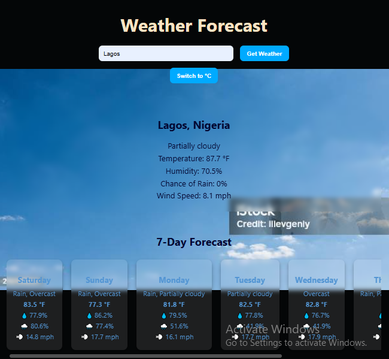

# The-weather-app

A sleek weather forecast web app built using the [Visual Crossing Weather API](https://www.visualcrossing.com/). Users can search for any location and view the current weather and a 7-day forecast, and toggle temperature units (Celsius or Fahrenheit).

## 🔗 Live Demo

https://hencci.github.io/The-weather-app/
---

## Table of Content

* [Featutes](#fearures)
* [Project structure](#project-structure)
* [Technologies used](#technologies-used)
* [Getting started](#getting-started)
* [Contributions](#contributions)
* [Contact](#contact)

## 📸 Features

- 🔍 **Location-based Search** — Get weather data for any city or location.
- 🌡️ **Temperature Unit Toggle** — Easily switch between Fahrenheit and Celsius.
- 📊 **Detailed Current Conditions** — Includes temperature, humidity, windspeed, and chance of precipitation.
- 📅 **7-Day Forecast** — Horizontally scrollable forecast cards.
- ⏳ **Loading Indicator** — Shows a loading message while fetching data.
- 🚫 **Error Handling** — Gracefully informs users if a location is invalid or unavailable.

## 📁 Project Structure

weather-app/ <br>
├── index.html&nbsp;&nbsp;&nbsp; # Main HTML structure<br>
├── style.css&nbsp;&nbsp;&nbsp; # Styling and layout<br>
├── script.js&nbsp;&nbsp;&nbsp; # App logic, API integration, DOM updates<br>
├── README.md&nbsp;&nbsp;&nbsp; # Project info and instructions

## ⚙️ Technologies Used

- **HTML5**
- **CSS3**
- **JavaScript (ES6+)**
- **[Visual Crossing Weather API](https://www.visualcrossing.com/)**

## 📸 Preview



## 🚀 Getting Started

### 1. Clone the repository

```bash
git clone https://github.com/hencci/The-weather-app.git
cd The-weather-app
```

### 2. Get a free API key
Sign up at Visual Crossing and get your free API key

### 3. Add your API key
In script.js, replace the placeholder with your actual key:
```bash
const apiKey = 'YOUR_API_KEY_HERE';
```

### 4. Open the app
Open index.html in your browser or serve with Live Server (VS Code extension recommended).

## 📜 License

This project is open-source and available under the MIT License.

## 💡 Contributions

Feel free to fork this repository and improve the project! 🚀
PRs are welcome! 😊

## Contact

Created by [Henry Moses](https://github.com/hencci)
Feel free to reach out if you have any questions